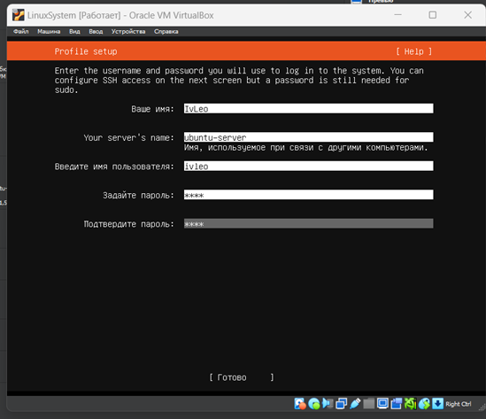

# Установка Ubuntu
### Для начала, выбираем имя VM, вставляем наш файл ISO, выбираем корневую папку для VM

### Далее определяем кол-во выделяемой памяти под нашу OC и кол-во ядер для процессов

### Создаем виртуальный жесткий диск

### Выбор языка

### Определение с сетью. Можно вручную изменить параметры.

### Выделение памяти

### Создание пользователя

### Далее определяем скачивание утилит и приложений на Ubuntu.